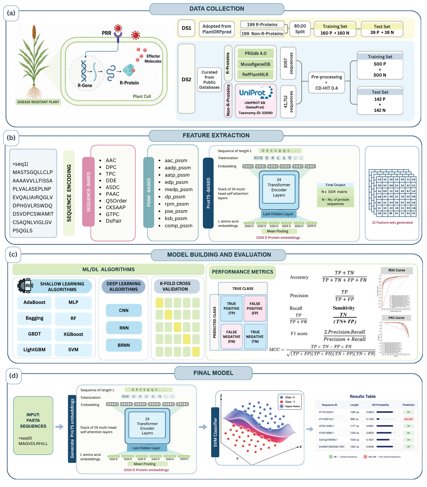

# PlantDRP : Leveraging ProtT5 embeddings and support vector machine for prediction of plant disease resistance proteins

<p align="center">
  
</p>

**Prediction of Plant Disease Resistance Proteins**


[](https://www.python.org/)
[](https://iasri.icar.gov.in/)

PlantDRP predicts disease resistance (R) proteins in plants directly from protein sequences, using **ProtT5-XL-U50** protein language model embeddings and a **Support Vector Machine** classifier. It requires no structural data, sequence alignment, or homology information.

---

## Table of Contents

- [Overview](#overview)
- [Features](#features)
- [Installation](#installation)
- [Quick Start](#quick-start)
- [Usage](#usage)
  - [Web Interface](#web-interface)
  - [Command Line Interface](#command-line-interface)
  - [Python API](#python-api)
- [Models](#models)
- [Input Format](#input-format)
- [Output Format](#output-format)
- [System Requirements](#system-requirements)
- [Citation](#citation)
- [Authors](#authors)
- [License](#license)

---

## Overview

Plant disease resistance (R) proteins are key components of the plant immune system. They detect pathogen-derived effectors and activate defense responses, protecting crops from bacteria, fungi, viruses, oomycetes, and nematodes. Experimental identification of R proteins is resource-intensive and time-consuming.

PlantDRP provides a fast, accurate, sequence-only computational approach for R protein prediction, enabling large-scale genome annotation and supporting crop protection research.

---

## Features

- **Sequence-only prediction**: no structural data or alignment required
- **Two SVM models**: DS1 (experimentally validated) and DS2 (extended database, recommended)
- **ProtT5-XL-U50 embeddings**: 1024-dimensional protein language model features
- **Web interface**: browser-based UI with file upload, charts, and CSV download
- **Command-line interface**: scriptable, batch-compatible, pipeline-ready
- **Python API**: importable library for integration into custom workflows
- **GPU support**: NVIDIA CUDA acceleration for fast embedding generation
- **Multiple output formats**: CSV, TSV, and JSON

---

## Installation

**Prerequisites: install PyTorch first:**

Visit [https://pytorch.org](https://pytorch.org) and select your OS and CUDA version before installing PlantDRP.

**Install from PyPI:**

```bash
# CLI only
pip install plantdrp

# With web interface
pip install plantdrp[ui]
```

**Install from GitHub:**

```bash
pip install git+https://github.com/PrabinaMeher/plantDRP.git

# With web interface
pip install "plantdrp[ui] @ git+https://github.com/PrabinaMeher/plantDRP.git"
```

**Verify installation:**

```bash
plantdrp info
```

> **Note:** ProtT5-XL-U50 model weights (~3 GB) are downloaded automatically from HuggingFace on first run and cached at `~/.cache/huggingface/`.

---

## Quick Start

```bash
# Launch web interface
plantdrp ui

# Predict from command line
plantdrp predict --input proteins.fasta --model ds2 --output results.csv

# Check version and model status
plantdrp info
```

---

## Usage

### Web Interface

```bash
plantdrp ui
```

Opens at  `http://localhost:8000` (FastAPI) in your default browser.

**Steps:**
1. Upload a protein FASTA file
2. Select model - DS1 or DS2 (DS2 recommended)
3. Click Run Analysis
4. View results: probability scores, bar chart, classification split
5. Download results as CSV

**Custom port:**

```bash
plantdrp ui --port 8502
```

---

### Command Line Interface

**Basic prediction:**

```bash
plantdrp predict --input proteins.fasta --model ds2
```

**All options:**

```bash
plantdrp predict \
    --input     proteins.fasta \
    --model     ds2 \
    --output    results.csv \
    --format    csv \
    --threshold 0.5 \
    --device    auto
```

**Save as TSV:**

```bash
plantdrp predict --input proteins.fasta --model ds2 --format tsv --output results.tsv
```

**Save as JSON:**

```bash
plantdrp predict --input proteins.fasta --model ds2 --format json --output results.json
```

**Use GPU:**

```bash
plantdrp predict --input proteins.fasta --model ds2 --device cuda
```

**All CLI flags:**

| Flag | Description | Default |
|---|---|---|
| `--input` / `-i` | Path to input FASTA file | required |
| `--model` / `-m` | Model: `ds1` or `ds2` | `ds2` |
| `--output` / `-o` | Output file path | `plantdrp_results.csv` |
| `--format` / `-f` | Output format: `csv`, `tsv`, `json` | `csv` |
| `--threshold` / `-t` | Probability cutoff (0–1) | `0.5` |
| `--device` | Device: `auto`, `cpu`, `cuda`, `mps` | `auto` |
| `--verbose` | Print per-sequence progress | `True` |

---

### Python API

**Basic usage:**

```python
from plantdrp import Predictor

pred = Predictor(model="ds2")
df   = pred.predict("proteins.fasta")
print(df)
```

**Custom settings:**

```python
pred = Predictor(
    model="ds2",
    device="cuda",
    threshold=0.6,
)
df = pred.predict("proteins.fasta")
df.to_csv("results.csv", index=False)
```

**Predict from sequences directly (no FASTA file needed):**

```python
pred = Predictor(model="ds2")
df   = pred.predict_sequences(
    sequences=["MAKTLVLK...", "MSSDQQQL..."],
    seq_ids=["protein_A", "protein_B"]
)
```

**Filter DR proteins only:**

```python
dr_proteins = df[df["prediction"] == "DR"]
print(dr_proteins)
```

**Output DataFrame columns:**

| Column | Description |
|---|---|
| `id` | Sequence ID from FASTA header |
| `length_aa` | Sequence length in amino acids |
| `probability` | P(DR protein), range 0–1 |
| `prediction` | `DR` or `Non-DR` |
| `model` | `DS1` or `DS2` |

---

## Models

PlantDRP provides two SVM models trained on different datasets:

### DS1: Experimentally Validated Set

| Property | Value |
|---|---|
| Source | PlantDRPpred |
| Positive sequences | 199 experimentally validated R-proteins |
| Negative sequences | 199 non-R-proteins |
| Total | 398 sequences |
| Training / Test split | 80% / 20% |

**Cross-validation performance:**

| Metric | DS1 |
|---|---|
| Sensitivity (Sn) | 93.748% |
| Specificity (Sp) | 96.252% |
| Accuracy (Acc) | 95.0% |
| MCC | 0.9014 |
| AUROC | 0.9729 |
| AUPRC | 0.9744 |

**Independent test set performance:**

| Metric | DS1 |
|---|---|
| Sensitivity (Sn) | 87.18% |
| Specificity (Sp) | 94.87% |
| Accuracy (Acc) | 91.03% |
| MCC | 0.823 |
| AUROC | 0.9224 |
| AUPRC | 0.9474 |

---

### DS2: Extended Database Set ★ Recommended

| Property | Value |
|---|---|
| Sources | PRGdb 4.0 · MusaRgeneDB · RefPlantNLR |
| Positive sequences | 642 (after CD-HIT ≤40% similarity) |
| Negative sequences | 9,759 (UniProtKB Viridiplantae) |
| Redundancy filter | CD-HIT ≤40% sequence similarity |

**Cross-validation performance:**

| Metric | DS2 |
|---|---|
| Sensitivity (Sn) | 93.8% |
| Specificity (Sp) | 97.6% |
| Accuracy (Acc) | 95.7% |
| MCC | 0.9147 |
| AUROC | 0.9821 |
| AUPRC | 0.9877 |

**Independent test set performance:**

| Metric | DS2 |
|---|---|
| Sensitivity (Sn) | 92.96% |
| Specificity (Sp) | 96.5% |
| Accuracy (Acc) | 94.74% |
| MCC | 0.8953 |
| AUROC | 0.9812 |
| AUPRC | 0.9864 |

**Experimentally validated test set (162 R-proteins):**

| Metric | DS2 |
|---|---|
| Sensitivity (Sn) | 96.91% |
| Specificity (Sp) | 93.83% |
| Accuracy (Acc) | 95.37% |
| MCC | 0.9078 |
| AUROC | 0.9647 |
| AUPRC | 0.9367 |

DS2 consistently outperforms DS1 and is recommended for general use.

---

## Input Format

- **Protein (amino acid) sequences only**: nucleotide sequences are not supported
- **Standard FASTA format** with header lines starting with `>`
- **Minimum sequence length:** 50 amino acids
- **Non-standard residues** (B, J, O, U, X, Z) will be flagged with a warning

**Example:**

```
>AT1G12220.1 Arabidopsis thaliana NLR resistance protein
MSDNLKQELKELIEQLKKNPAVVKQFLDDIQKEMKDLEDELEAQMKELKDKIEALRQ...
>Os01g0700900.1 Oryza sativa NLR immune receptor
MASTQQLLLAAAVVVKKNPAVVKQFLDDIQKEMKDLEDELEAQMKELKDKIEALRQ...
```


## Output Format

**CSV (default):**

```
id,length_aa,probability,prediction,model
AT1G12220.1,1294,0.9823,DR,DS2
AT1G59124.1,868,0.1204,Non-DR,DS2
Os01g0700900.1,1025,0.7821,DR,DS2
```

**JSON:**

```json
[
  {"id": "AT1G12220.1", "length_aa": 1294, "probability": 0.9823, "prediction": "DR", "model": "DS2"},
  {"id": "AT1G59124.1", "length_aa": 868,  "probability": 0.1204, "prediction": "Non-DR", "model": "DS2"}
]
```

---

## 💻 System Requirements

| Component | Minimum (CPU) | Recommended (CPU) | Recommended (GPU) |
|-----------|---------------|-------------------|-------------------|
| Python | 3.9+ | 3.9+ | 3.9+ |
| RAM | 16 GB | 32 GB | 32 GB+ |
| Storage | 6 GB free | 10 GB free | 10 GB free |
| GPU | Not required | Not required | NVIDIA GPU (8 GB+ VRAM) |
| CUDA | — | — | CUDA 11.8+ |
| Operating System | Windows, Linux, macOS | Windows/Linux | Linux recommended |
| Embedding Speed | ~20–40 s/sequence | ~8–20 s/sequence | ~1–3 s/sequence |

> **Note**
>
> PlantDRP uses the **ProtT5-XL-UniRef50** protein language model to generate sequence embeddings. While the application can run on systems with **16 GB RAM**, loading the model may exceed available memory depending on the operating system and background applications. For reliable execution, **32 GB RAM is recommended**, especially for processing multiple sequences.

###  Performance Notes

- **First run:** Downloads the ProtT5 model (~5 GB) and caches it locally.
- **Embedding generation** is the computational bottleneck.
- **SVM inference** is nearly instantaneous after embeddings are generated.
- For datasets containing **100+ protein sequences**, using a **CUDA-enabled GPU** or the **CLI** is strongly recommended.

### Approximate Resource Usage

| Task | Resource Usage |
|------|----------------|
| Model download (first run) | ~5 GB |
| Peak RAM during embedding generation | 16–24 GB (CPU) |
| CPU Utilization | High |
| SVM Prediction | <1 second |

---

## Demo

A sample FASTA file is bundled with the package:

```bash
plantdrp predict \
    --input example_data/sample.fasta \
    --model ds2 \
    --output results.csv
```

---

## Citation

*The associated manuscript has been submitted for publication. The citation will be updated upon acceptance.*

**Provisional citation:**

```
Pradhan UK†, Gupta A†, Kumar S, Kumari A, Das R, Kumar A, Meher PK*.
PlantDRP: Leveraging ProtT5 embeddings and support vector machine for
prediction of plant disease resistance proteins.
[Manuscript submitted, 2025]
```

† Joint first authors  
\* Corresponding author

**BibTeX:**

```bibtex
@article{plantdrp2025,
  title   = {PlantDRP: Leveraging ProtT5 embeddings and support vector machine
             for prediction of plant disease resistance proteins},
  author  = {Pradhan, Upendra Kumar and Gupta, Aanchal and Kumar, Shubham
             and Kumari, Arzoo and Das, Ritwika and Kumar, Anil
             and Meher, Prabina Kumar},
  year    = {2025},
  note    = {Manuscript submitted}
}
```

---

## Authors

| Name | Role | Affiliation |
|---|---|---|
| Upendra Kumar Pradhan | Joint First Author | Division of Statistical Ecology and Environmental Statistics, ICAR-IASRI |
| Aanchal Gupta | Joint First Author | Division of Statistical Ecology and Environmental Statistics, ICAR-IASRI |
| Shubham Kumar | Contributor | Division of Statistical Ecology and Environmental Statistics, ICAR-IASRI |
| Arzoo Kumari | Contributor | Division of Statistical Ecology and Environmental Statistics, ICAR-IASRI |
| Ritwika Das | Contributor | Division of Statistical Ecology and Environmental Statistics, ICAR-IASRI |
| Anil Kumar | Contributor | ICAR, New Delhi |
| **Prabina Kumar Meher** | **Corresponding Author** | Division of Statistical Ecology and Environmental Statistics, ICAR-IASRI |

**ICAR-Indian Agricultural Statistics Research Institute (ICAR-IASRI)**  
Division of Statistical Ecology and Environmental Statistics 
PUSA, New Delhi – 110012, India

✉ meherprabin@yahoo.com  

---


*PlantDRP · ICAR-IASRI · New Delhi · 2025*
